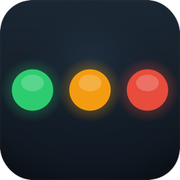
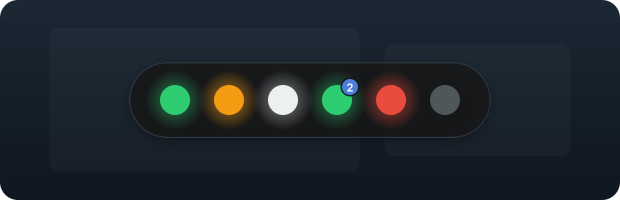
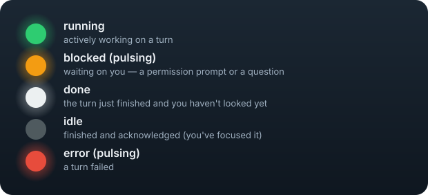
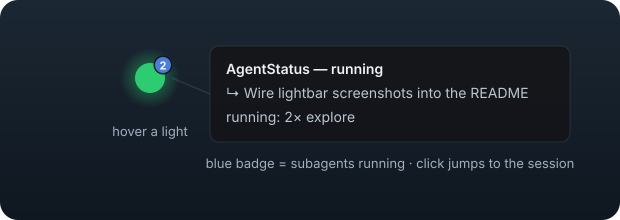
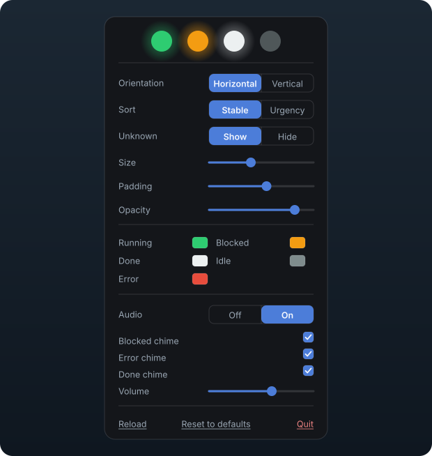
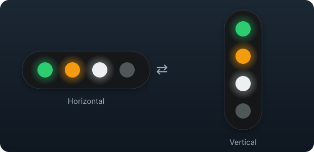

<div align="center">



# AgentStatus

**A small bar of lights that stays above all other windows. It shows the live state of
each open Claude Code or Cursor session. You see immediately which sessions run, which
wait for you, which are idle, and which have an error.**

[](https://github.com/Gameslayer999/AgentStatus/releases/latest)
[](https://github.com/Gameslayer999/AgentStatus/releases)


[Install](#install-macos-apple-silicon) · [The lights](#the-lights) · [Customize](#customize-it) · [How it works](#how-it-works) · [VS Code extension](#optional--vs-code-extension)

</div>



<sub>One light for each session. From left to right: running, blocked, done, running with
2 subagents, error, idle. The bar stays above all other windows, also full-screen
applications.</sub>

When you run many agent sessions in different projects and windows, it is difficult to
know their state. AgentStatus shows one colored light for each session. The bar stays
above all other windows, also full-screen applications. The lights change immediately.
Click a light to go directly to that session.

AgentStatus operates with **Claude Code in VS Code**, **in the terminal**, and **in Claude
Desktop**, and with the **Cursor agent**. They all use the same hook. An optional VS Code
extension adds a status-bar item to each VS Code window.

## Install (macOS, Apple Silicon)

The DMG is the fastest method. You do not need build tools. The application installs its
own hooks at the first start.

**Requirements:** macOS on Apple Silicon (M1 or later), and Claude Code or Cursor.

> [!IMPORTANT]
> AgentStatus is **not signed and not notarized**. Thus macOS Gatekeeper stops it at the
> first start. Step 3 removes the download quarantine, and the application starts.

1. Download **`AgentStatus_0.7.0_aarch64.dmg`** from the
   [latest release](https://github.com/Gameslayer999/AgentStatus/releases/latest).
2. Open the DMG. Drag **AgentStatus** into **Applications**.
3. Remove the download quarantine and start the application:

   ```bash
   xattr -dr com.apple.quarantine /Applications/AgentStatus.app
   open /Applications/AgentStatus.app
   ```

   As an alternative, double-click the application and let macOS stop it. Then open
   **System Settings → Privacy & Security**. Find the message "AgentStatus was blocked".
   Click **Open Anyway**. On macOS 15 and later, right-click → Open does not remove this
   block for downloaded applications.

At the first start, the application **installs its own hooks**. It writes
`~/.claude/status/report.sh`. It registers that script for Claude Code
(`~/.claude/settings.json`) and for Cursor (`~/.cursor/hooks.json`). It makes a backup of
the initial files first. **Claude Code sessions that are already open use the hook
immediately. A restart is not necessary.**

Claude Code reads that one settings file in VS Code, in the terminal, and in Claude
Desktop, so this single registration covers all three. There is nothing to install per
terminal and nothing to alias.

AgentStatus is an accessory application and has **no Dock icon**. To start it at login,
add it in **System Settings → General → Login Items**.

**Accessibility permission:** give AgentStatus **Accessibility** permission in System
Settings → Privacy & Security → Accessibility. For VS Code this permission is optional.
With the permission, a click on a light shows a window in the same Space in approximately
0.2 s. Without the permission, the click uses the slower IDE command line and needs
approximately 1 s. For **Cursor**, this permission is necessary. Without it, a click only
brings Cursor to the front.

**Automation permission:** the first time you click a light for a **terminal** session,
macOS asks whether AgentStatus may control that terminal application. Click **OK**. This is
what selects the tab, so a refused prompt leaves the click bringing the terminal to the
front on whatever tab was last used. It is a separate grant from Accessibility, asked once
per terminal application, and you can change it later in System Settings → Privacy &
Security → Automation.

### Build from source instead

If you have an Intel Mac, or if you want to build the application yourself:

```bash
./install.sh
```

This needs [Rust](https://rustup.rs), Node, and `jq` (`brew install jq`). The script
builds the application and copies it to `/Applications`. The application installs its own
hooks at the first start, as the DMG does. For a new installation, do the Gatekeeper step
above.

## The lights

Each light is one session: Claude Code in VS Code, in a terminal, or in Claude Desktop, or
a Cursor agent.





- **A white light is unread.** That session completed a turn, and you did not look at it.
  A click on the light moves you to the session and makes the light gray. The next
  completed turn makes it white again. This applies to Claude Code sessions and to Cursor
  sessions.
- **A hollow ring** is a session that reports no state, such as a Cursor window with no
  open folder. The bar shows "unknown" instead of a color it would only guess. A click
  opens that agent conversation. Set **Unknown → Hide** in the settings to keep these
  rings off the bar.
- **A ring pip** at the end of the bar counts the Cursor agents that wait for you and have
  no light of their own. Click the pip to open the next one in the queue.
- **An orange light always means one thing: that session waits for you to decide.** It is a
  permission prompt, a question, or a **background agent** that stopped to ask you something
  and now waits for the answer. Click it to go there.
- **Stop a turn and the light goes gray.** Interrupt a running session with Ctrl+C or Esc and
  its light turns gray within about a second. The bar does not wait to be told — it reads
  Claude Code's own report that the session is back at its prompt, which is also what clears
  a light left green by an event that never arrived. It turns gray, not white: nothing
  finished, so there is nothing waiting for you to read. A session that keeps working after
  you close its tab keeps its green light.
- **A light goes away when the session does.** Close the tab, quit the editor, or type
  `exit`, and the light goes on the next check. A **background agent** has no terminal to
  close and Claude Code keeps it running after it finishes, so its light stays for five
  more minutes and then goes — long enough to see that it finished, short enough that
  yesterday's agents do not fill the bar. A light waiting on you (orange or red) is never
  removed on a timer, so a background agent that waits for an answer keeps its light — and
  its click — until you answer it. A background agent that works keeps a green light for as
  long as it works, however quiet it is.
- **Put the pointer on a light** to see the project, the session name, the application the
  session runs in, the task, and the current operation. The session name is the name the
  host gives the session — for example `agentstatus-5b` in Claude Code, or the name of the
  agent conversation in Cursor. This name tells two sessions in the same project folder
  apart. The application is named as you know it — `VS Code`, `Cursor`, `Claude Desktop`,
  or, for a terminal session, the terminal itself (`Ghostty`, `Terminal`, `iTerm2`). A
  detached background agent runs in no application and says `background agent`.
- **A blue badge** on a light shows the number of subagents in that session. The tooltip
  gives their types.
- **Click a light** to go to that session. In VS Code, the window comes to the front and
  shows the tab of the session. In Cursor, the application opens that agent conversation.
  For a **terminal** session, Terminal.app and Ghostty come to the front with that
  session's tab selected — in Ghostty, its split too; another terminal application comes to
  the front without tab selection. For a session in **Claude Desktop**, Claude comes to the
  front. A **background agent** has no terminal of its own, so the first click opens it in a
  Ghostty tab; every click after that goes to the tab that is already open, never to a new
  one.
- **Right-click the bar** to open the settings.
- **Drag the bar** to move it. Hold the bar by the padding, not by a light. The
  application keeps the position.

## Customize it

**Right-click** the bar to open the settings panel. All settings stay after a restart.



- **Mode** — show the lights as the floating bar (default) or in the **macOS menu bar**.
  Refer to [Run it in the menu bar instead](#run-it-in-the-menu-bar-instead).
- **Orientation** — change the bar between a horizontal row and a vertical column. The
  window changes its size to fit the new shape.



- **Sort** — **Stable** (default) keeps each light in the slot it got when its session
  appeared, so a light never moves while you aim at it and a new session goes to the end of
  the bar. **Urgency** moves the attention states (error, then blocked, then done) to the
  front, so a light moves when its own state changes.
- **Unknown** — **Show** (default) or **Hide** the hollow rings.
- **Size, padding, and opacity** — change the size of the lights, the space in the bar,
  and the opacity of the bar. The lights stay fully opaque.
- **Colors** — change the color of each of the five states with the macOS color picker.
- **Audio alerts** — off by default. Set **Audio** to on to get a short tone when a
  session becomes blocked, has an error, or completes a turn. In the sub-panel, select
  which of the three events make a tone, and set the volume. The tone sounds one time at
  the change of state, and only while the application runs.

### Run it in the menu bar instead

For a smaller and permanent presence, set **Mode → Menu bar** in the settings panel. The
same lights become a live item in the macOS menu bar. Click the item to show the full bar
as a popover. Click-to-focus, tooltips, and subagent badges continue to operate.

- **Dots or Single** — show one dot for each session (default), or one dot for the most
  urgent state (error, then blocked, then done, then running, then idle). One dot uses
  less menu-bar width.
- Menu-bar mode is always horizontal. The Orientation control is not available.
- macOS controls the position of menu-bar items. Hold ⌘ and drag the item one time to set
  its position. The system keeps that position.

> [!NOTE]
> The macOS menu bar hides itself in full-screen applications. Thus in menu-bar mode the
> lights are not visible in a full-screen window. Use the floating bar for full-screen
> work, and the menu bar for other work.

## How it works

AgentStatus has two parts:

- **The signal layer** — one hook script (`report.sh`) starts at each session event. It
  writes the state of that session to `~/.claude/status/sessions/<id>.json`. The hook is
  global, thus one installation covers all projects and all Claude Code and Cursor
  windows. The hook does the minimum work and stops immediately. It does not delay a turn.
- **The display layer** — a Tauri application reads that directory and shows the lights,
  as the floating bar or as the menu-bar item.

The status files contain only the data for the lights: the session ID, the state, a short
project name, and a time. AgentStatus does not store prompt text or transcript text.

For the reasons for these decisions, refer to [DECISIONS.md](DECISIONS.md).

## Optional — VS Code extension

The extension adds a status-bar item to each VS Code window, for the workspace of that
window. It has the same click-to-focus and the same tooltip, without the session name. It
reads the same status files, thus it needs the application (or the development hooks) for
the signal.

It shows **Claude Code sessions in VS Code only**. A Cursor agent, a terminal session, or a
session in Claude Desktop can sit in the same project folder, but it has no tab in this
window, so the extension leaves it out. The floating bar shows those and opens them in the
correct application.

```bash
code --install-extension extension/claudestatus-0.1.2.vsix
```

## Uninstall

```bash
node hooks/setup.mjs uninstall     # remove the hooks from settings.json
rm -rf /Applications/AgentStatus.app ~/.claude/status
```

The backup of your initial settings is at `~/.claude/settings.json.agentstatus-bak`.

## Develop

```bash
cd app
npm install
node ../hooks/setup.mjs install   # register the repo hooks (development uses hooks/report.sh)
npm run tauri dev
```

In development, the application does **not** install its own hooks. Thus changes to
`hooks/report.sh` are immediately in use, and a rebuild is not necessary. The release
build installs its own hooks. Use `node hooks/setup.mjs status|uninstall` to control the
development hooks.

### Make a release

GitHub Actions builds and publishes the releases. Set the new version in
`app/src-tauri/tauri.conf.json`, `app/package.json`, and `app/src-tauri/Cargo.toml`. Merge
to `main`. Then push a tag with the same version:

```bash
git tag v0.7.0 && git push origin v0.7.0
```

The workflow builds the arm64 DMG on a macOS runner and publishes it with generated
notes. The workflow stops if the tag does not agree with the version in
`tauri.conf.json`. A merge to `main` publishes nothing. The tag starts the workflow.

## Limits

- **macOS only, and the DMG is for Apple Silicon.** For Intel, build from source.
- **Downloaded builds are not signed and not notarized**, thus the Gatekeeper step above
  is necessary.
- **Cursor has no blocked light.** Cursor sends no permission event, so its lights show
  running, done, and idle only.
- **Cursor needs the Accessibility permission** for click-to-focus and to keep its lights
  correct. Without it, a click only brings Cursor to the front, and a long-silent agent
  can go gray while it still works.
- **Terminal.app and Ghostty get tab-precise focus; other terminals do not.** Terminal.app
  publishes a tty for each tab. Ghostty 1.3 and later publish a title for each tab and
  split, which the bar matches against the session title Claude Code writes there. A
  session Claude has not titled yet, two sessions whose titles do not tell them apart, and
  any other terminal application fall back to bringing the application to the front so you
  pick the tab — as does a refused Automation prompt (see **Automation permission** above).
  When the terminal is already the front application, that fallback has nothing left to do,
  so the click looks like it did nothing. The common cause is a session that has never
  produced a titled turn — for example a terminal you used only to start a background agent,
  which then shows that agent's title rather than one of its own.
- **A background agent opens in a new terminal tab.** `claude --bg` runs detached from any
  terminal, so there is no tab to show. A click opens one running `claude attach` for that
  agent instead — a tab in the Ghostty you already have open, or a Terminal.app window when
  Ghostty is not running. Ghostty before 1.3 gets a second Ghostty window, since only 1.3
  and later can be asked for a tab.
- **A light Claude Code does not recognize does nothing when clicked.** Claude Code
  pre-warms spare processes that briefly look like sessions; the bar drops such a light as
  soon as it can tell, and a click on one in the meantime is ignored rather than opening a
  terminal for a session that does not exist.
- **Claude Desktop chat threads have no light.** Claude Desktop provides no hook and keeps
  no conversation state on disk, so the bar has nothing to read. Claude Code *inside*
  Claude Desktop is fully supported; ordinary chat conversations are not.
